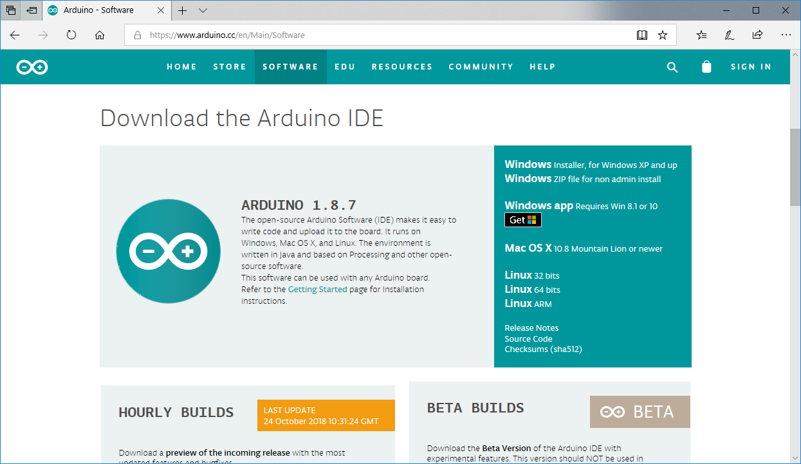
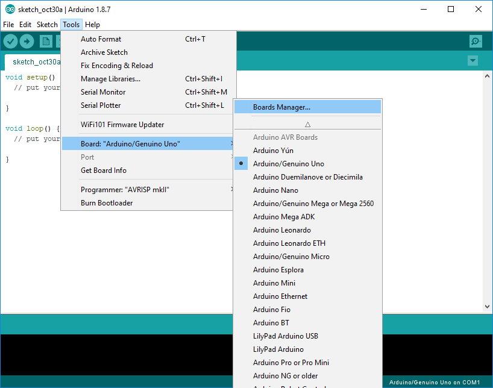
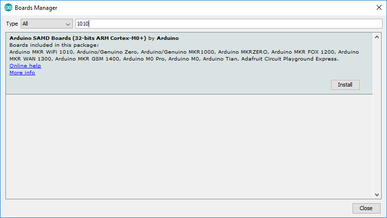
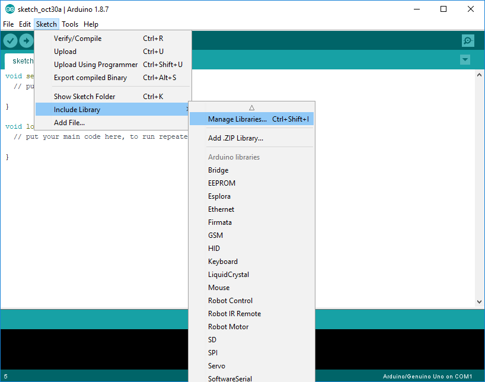
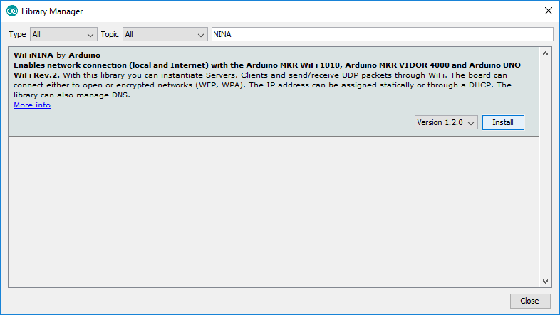
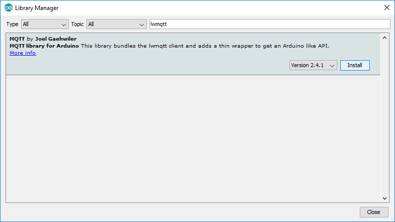
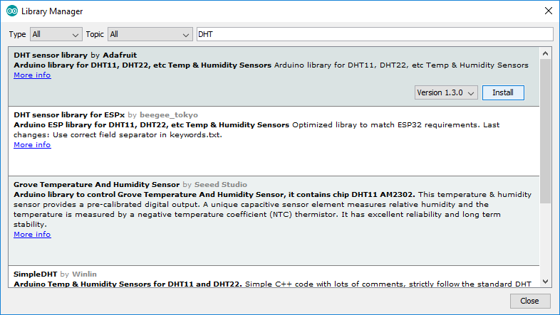
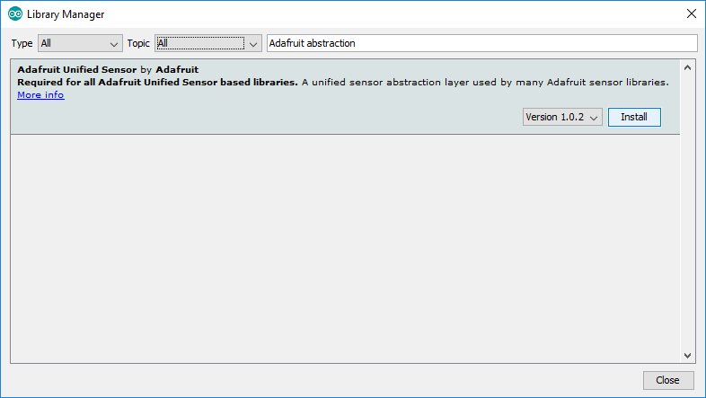

# Exercise 1 - Development Environment

Set up your computer for writing Arduino code.

## Arduino IDE
Install the Arduino IDE from https://arduino.cc/downloads

        
### Arduino SAMD Board Definitions
Use the Arduino Boards Manager to install the Arduino SAMD Board definitions. Open the Boards Manager using the menu _Tools -> Boards -> Boards Manager_

Search for "1010" and install the Arduino SAMD Boards (32-bit ARM Cortex-M0+) definitions.

        
### Arduino Libraries        
Install the following Arduino Libraries using the Library manager. 

    * WiFiNINA library (search for "NINA")
    * Joël Gähwiler's MQTT library (search for "lwmqtt")
    * DHT sensor library by Adafruit (search for "DHT")
    * Adafruit Unified Sensor library (search for "adafruit abstraction")

Open the library manager using the menu _Sketch -> Include Libraries -> Manage Libraries_

WiFiNINA library (search for "NINA")

Joël Gähwiler's MQTT library (search for "lwmqtt")

DHT sensor library by Adafruit (search for "DHT")

Adafruit Unified Sensor library (search for "adafruit abstraction")

