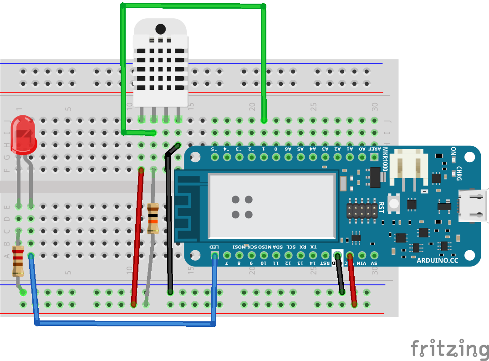

# Exercise 2: Assemble the Hardware

Use the parts in the kit and assemble the hardware.

## Wiring

Suggested wiring instructions:

1. Orient the solderless breadboard with A1 on the bottom left.
1. Plug the Arduino MKR WiFi 1010 into the breadboard with the 5V pin in A30. You should see 3 rows above the board and 0 row below the board.
1. Plug the DHT-22 with the left pin in J11. Note this is very close to the Arduino. We're going to need a lot of room for more components later in the day.
   * Use a red wire from the positive rail to F11
   * Put a 10,000 &#937; resistor from the positive rail to F12.
   * Place a black wire from the negative rail to F14
   * Note that column 13 is not used, the DHT-22 has an extra pin.
   * Run a green wire from G12 to J21 which is pin 1 on the Arduino.
1. Plug a LED into E1 and E2. Make sure the longer leg is in E2.
   * Run a 220 &#937; resistor from the negative rail to C1
   * Run a blue wire from A2 into pin 6 on the Arduino.
1. Run a black wire from A27 to the negative rail
1. Run a red wire from A28 to the positive rail

## Hardware Test

1. Open arduino/HardwareTest/HardwareTest.ino in the Arduino IDE
1. Choose the board _Tools -> Board -> Arduino MKR WiFi 1010_
1. Choose the port _Tools -> Port -> COM 3 (Arduino MKR WiFI 1010)_ Note that the actual port may be different on your computer
1. Upload the code to the board _Sketch -> Upload_
1. The LED should be a solid color
1. Open the serial monitor _Tools -> Serial Monitor_
1. The LED should start blinking and you should see temperature and humidity data in the serial console

## Network Test

1. Open arduino/NetworkTest/NetworkTest.ino in the Arduino IDE
1. Edit the ssid and password on the arduino_secrets.h tab
1. Upload the code to the board _Tools -> Upload_
1. Open the serial monitor _Tools -> Serial Monitor_
1. Look for the message "IT WORKS!"
