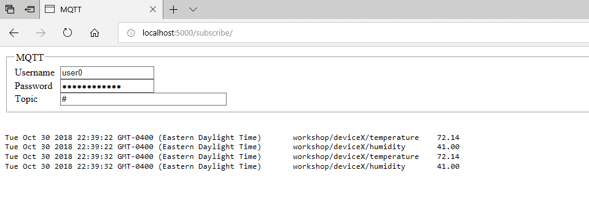

# Exercise 4: Viewing MQTT data

In the last module, the Arduino was publishing data to MQTT topics. In this module, we will write code to subscribe to MQTT topics and view the data.

1. Open www/subscribe/index.html in a text editor
1. Update the username and password values in the HTML form
1. Open www/subscribe/index.html in your browser
1. Press connect to view all data using the **#** wildcard
1. Disconnect
1. Change the topic name to display the temperature from your device "workshop/deviceX/temperature"
1. Disconnect
1. Use the **+** wildcard to view all the data from your device "workshop/deviceX/+"
1. Disconnect
1. Try the **+** wildcard to view everyone’s humidity data "workshop/+/humidity"
1. Experiment with some additional topic using wildcards
1. Open www/subscribe/index.js and examine the MQTT code
1. Try adjusting how the data is displayed on the page

If you have [nodejs](https://nodejs.org/en/) installed, you can use [serve npm](https://www.npmjs.com/package/serve) to serve the web pages on port 5000. Alternately you can open index.html directly from the file system.