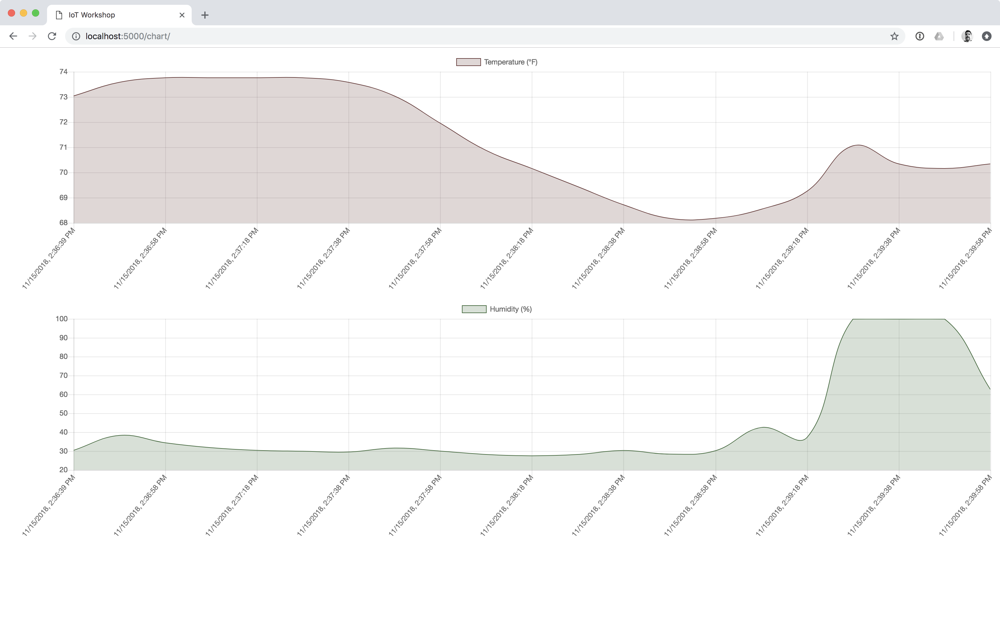

# Exercise 5: Graphing MQTT Data

1. Open www/chart/* in your editor
1. Change the deviceId, username, and password in www/chart/mqtt.js[1](#footnote1)
1. Open www/chart/index.html in your browser
1. Data will be plotted on the charts as it is read from MQTT
1. If you're not seeing data, double check the deviceId. Try breathing on the sensor to change the values.

The chart can be modified by editing [/www/chart/chart.js](/www/chart/chart.js). There is a second chart example in [/www/combined-chart](/www/combined-chart) that plots both series on one graph.

<a name="footnote1">Note 1</a>: Don't use code like this on a public server since the username and password are hardcoded in the javascript.
